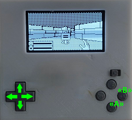
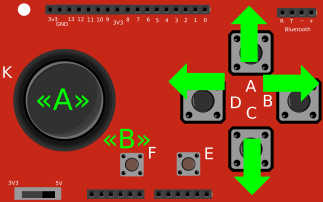
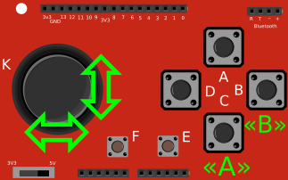

# 1. О проекте
Данный проект является ответвлением от Arduboy-homemade-package, развиваемого пользователем MrBlinky и основанного на библиотеке Arduboy2 пользователя MLXXXp. В развиитии Arduboy (основанного пользователем Kavin Bates) участвовали многие люди, во время разработки изучался опыт пользователя harbaum. 

Проект посвящен реализации возможности запуска игр, разработанных для Arduboy, на нестандартных аппаратных платформах. Он возник из-за интереса автора к микроконтроллерам и отладочным платам для них, разрабатываемым и производимым в России.

# 2. Структура проекта

  ## 2.1 Папка [board-package-source/libraries](./board-package-source/libraries)
  В папке находятся программные библиотеки, используемые совместно с Arduino IDE (и соответствующим Board Support Package - BSP). 

Программные библиотеки обеспечивают независимость программного кода игры от аппаратного обеспечения. Программные библиотеки выполняют такие функции, как формирование экранного буфера и вывод его на экран, формирование и вывод звука, опрос состояния органов управления и т.д.

Для сборки игр следует разместить библиотеки проекта в папке libraries внутри альбома с эскизами (скетчами) ArduinoIDE. Перед сборкой игр, следует выполнить настройки в библиотеках (см. раздел *"Аппаратное обеспечение"*)
  
Для использования совместно с платами ELRON ELBEAR следует установить BSP с сайта ELRON в Arduino IDE; текущая версия библиотек проекта используется совместно BSP версии 0.5.0.

 ## 2.2 Папка [games](./games)
 В папке находятся тексты игр, которые проверены и адаптированы для запуска в рамках проекта ("mik32" и "328p" в названии папки игры указывает на совместимость с конкретной аппаратной платформой), см. также раздел "Особенности сборки игр".

 ## 2.3 Папка [hardware](./hardware)
В папке  приведена полезная информация по сборке игровой приставки, в т.ч. конструкции корпуса 

# 3. Основные элементы и аппаратные функции 

## 3.1 Плата контроллера
 Поддерживаются платы: 
* на основе 8-ми битного контроллера ATmega328P и архитектуры AVR (платы Arduino UNO и NANO);
* на основе 32-х битного контроллера Микрон АМУР К1948ВК015/К1948ВК018 и архитектуры RISC-V (MIK32V2) (Платы ELRON ELBEAR UNO и ELRON ELBEAR NANO).

## 3.2 Устройство отображения

Поддерживаются монохромные экраны:
* с контроллером SSD1306 и SSD1309, интерфейс I2c, разрешение 128x64;

Для выбора данного типа экрана в файле `Arduboy2Core.h` внутри секции, соответствующей архитектуре контроллера, должна быть указана опция `#define OLED_SSD1306_I2C`

* c контроллером SH1106; интерфейс I2c, разрешение 128x64.

Для выбора данного типа экрана в файле `Arduboy2Core.h` внутри секции, соответствующей архитектуре контроллера, должна быть указана опция `#define OLED_SH1106_I2C`

Доступна функция "фонарик": если при включении контроллера удерживать джойстик/курсорные клавиши в направлении "вверх", экран будет залит белым цветом, что может использоваться для подсветки в темноте. При использовании джойстика следует сделать небольшую паузу после включения питания (на время калибровки центрального положения джойстика, см. раздел "Органы управления")

## 3.3 Средства формирования начального числа для генератора случайных чисел
Для генерации случайных чисел предусмотрена возможность формирования начального числа, для чего используется "шум", считываемый с помощью АЦП с  неподключенного вывод A2 плат в формате UNO/NANO.
В формировании начального числа кроме этого используется значение количества микросекунд с момента начала выполнения текущей программы.
Для увеличения измеряемого уровня шума для платформы MIK32 используется подтяжка к "минусу".
Для увеличения измеряемого уровня шума для платформы AVR 328p используется переключение типа опорного источника и измеряемого канала.

## 3.4  Средства экономии энергии

Экономия выполняется за счет отключения UART, TWI, ADC и реализована только для AVR 328p через регистр PRR и функцию `power_adc_disable()`. АЦП включается для работы джойстика и расчета начального числа генератора случайных чисел.

## 3.5  Органы управления  
Поддерживается следующее подключение органов управления (в соответствии с распиновкой плат Arduino):
1) Курсорные клавиши, вариант №1 :

| "⇐" | "⇒" | "⇑" | "⇓" | "A" | "B" |
|-----|-----|-----|-----|-----|-----|
|D2|D6|D3|D5|D4|D7|

*(Используется подтяжка к питанию)*

Для выбора данного режима управления в файле `Arduboy2Core.h` внутри секции, соответствующей архитектуре контроллера, опции `#define JOYSTICKDISCRETE` и `#define JOYSTICKANALOG` должны быть закомментированы.

 2) Курсорные клавиши, вариант №2 (например, для использования совместно с JoyStick Shield):

| "⇐" | "⇒" | "⇑" | "⇓" | "A" | "B" |
|-----|-----|-----|-----|-----|-----|
|D5|D3|D2|D4|D8|D7|

*(Используется подтяжка к питанию)*

Для выбора данного режима управления в файле `Arduboy2Core.h` внутри секции, соответствующей архитектуре контроллера, указывается опция `#define JOYSTICKDISCRETE`.

3) Аналоговый джойстик (JoyStick Shield): 

| "⇔" | "⇕" | "A" | "B" |
|-----|-----|-----|-----|
|D14|D15|D4|D3|

*(Выполняется пороговый выбор направления; кнопки A и B с подтяжкой к питанию)*

Для выбора данного режима управления в файле `Arduboy2Core.h` внутри секции, соответствующей архитектуре контроллера, указывается опция `#define JOYSTICKANALOG`.

При каждом включении питания приставки выполняется калибровка центрального положения джойстика, поэтому в момент включения питания не рекомендуется его отклонять.

Настройка порога отклонения от центрального положения, при котором происходит выбор направления джойстика, выполняется установкой переменных `JOYSENSX` и `JOYSENSY` в файле `Arduboy2Core.h`
Для комфортного управления джойстиком желательно устанавливать максимально возможный порог. Его значение определяется экспериментально.

Приблизительный диапазон значений для положения джойстика для MIK32: 150...4050.

Приблизительное значение для среднего положения джойстика для MIK32: 1900/2900 (переключатель уровня напряжения Joystick Shiled в положениях  3V3/5V соответственно).

Приблизительный диапазон значений для положения джойстика для AVR 328p: 10..680/10..1020  (переключатель уровня напряжения Joystick Shiled в положениях  3V3/5V соответственно).

Приблизительное значение для среднего положения джойстика для AVR 328p: 350/500 (переключатель уровня напряжения Joystick Shiled в положениях  3V3/5V соответственно).

## 3.6 Средства вывода звука

На текущий момент реализован вывод звука с подключением пьезодинамика, подключенного между выводами `SPEAKER_PIN_1` и "минус". Подключение с использованием `SPEAKER_PIN_2` пока не поддерживается.

Доступна функция включения/отключение вывода звука: если при включении контроллера совместно к клавишей "B" удерживать джойстик/курсорные клавиши в направлении "вверх/вниз", то будет произведено "включение/отключение" возможности вывода звука. Данная настройка глобальная (на уровне библиотеки, не зависит от настройки вывода звука в игре) и сохраняется в EEPROM. 
Управлять звуком при использовании джойстика следует после после небольшой паузы после включения питания (на время калибровки центрального положения джойстика, см. раздел "Органы управления").

Реализовано: 
* воспроизведение простых прямоугольных сигналов, формируемых таймером непосредственно на выводе контроллера;
* воспроизведение тонов и последовательностей тонов за счет переключения вывода контроллера по прерыванию таймера.

(Таймеры "Timer1" в режиме CTC -на AVR 328p и "Timer32_1_ch4", в режиме PWM - на MIK32).

## 3.7 Светодиодная индикация

На текущий момент не реализована.

## 3.8 Хранение данных в EEPROM

EPPROM контроллера AVR 328p имеет объем 1024 байт.

EPPROM контроллера АМУР MIK32 имеет объем 8192 байт, однако средствами BSP возможность записи для Arduino-программ ограничена последним килобайтом (с адреса 7168 по 8191). 

Карта памяти для EEPROM:
* байт 0 - зарезервирован для загрузчика;
* байты 1..15 -системные область (состояние звука, системные флаги, идентификатор ус-ва, шестибуквенное имя ус-ва);
* байты 16..1023 - пользовательские данные.

Возможность записи в средствами портированной под MIK32 библиотеки на текущий момент ограничена одной страницей (32 слова по 32 бита каждое), т.е. 128 байт, начиная с 7168 (для работы с системной областью). 
При этом запись в EEPROM средствами функций BSP (обычно применяется в тексте игр) таких ограничений не имеет.

# 4. Особенности сборки игр

## 4.1. Особенности сборки игр для архитектуры MIK32
BSP для MIK32 от ELRON позволяет использовать программы, разработанные в Arduino IDE под платформы AVR и для плат на контроллерах MIK32 Амур (практически без изменений программ).

Однако всё-таки существуют особенности работы BSP и архитектуры MIK32, из-за которых программы, написанные в Arduino IDE, могут безошибочно собираться для контроллеров AVR, но вызывать ошибки при сборке или выполнении для контроллеров MIK32 Амур. 

Ниже перечислены особенности, которые проявлялись при сборке игр с помощью BSP версии 0.5.0.
Следует учитывать, что BSP от ELRON постоянно развивается и совершенствуется. Тестирование с актуальными версиями BSP (0.5.1 и выше) еще не проводилось.

### 1) Требуется инициализация `EEPROM.begin()` при использовании функций `EEPROM.read`, `EEPROM.put` и т.п.

Необходимо добавлять в функцию `void setup()` вызов `EEPROM.begin();`.
Для плат Arduino UNO/NANO на контрлера AVR это не требуется, поэтому разработчики игр опускают вызов `EEPROM.begin();`.

### 2) Проблемы при вызове `EEPROM.put`

При вызове, подобном `EEPROM.put(offset, num)`, невозможно задать `num` числом (можно задать только через переменную). При этом `offset` обычно задано через директиву `#define`.
Обойти ошибку можно, если передать значение `num` с помощью переменной.

(Ожидается исправление в будущих версиях BSP)

### 3) Функции min (a,b) и max (a,b) работают только с операндами одного типа/размера

Вариант решения этой проблемы - добавить в текст программы: 

    #ifndef min
    #define min(a, b) (((a) < (b)) ? (a) : (b))
    #endif

    #ifndef max
    #define max(a, b) (((a) > (b)) ? (a) : (b))
    #endif
(Ожидается исправление в будущих версиях BSP)

### 4) Проблемы с вызовом функции через указатель

Неудачна попытка вызвать функцию:

    ((FunctionPointer) (&mainGameLoop[gameState]))();

Где:

     typedef void (*FunctionPointer) ();
     const FunctionPointer PROGMEM  mainGameLoop[] = {...} // перечень функций, соответствующих состоянию игры

Решение - переписать вызов функций с помощью `switch - case`

### 5) Зависание/зацикливание при отсутствии `return` в теле функции
  
Программа собирается, но выполняется непредсказуемо в случае, если функция объявлена с типом, отличным от `void` и при завершении функции отсутствует присвоение ей значения с использованием `return`
В играх для Arduboy отсутствие `return` распространено, но при выполнении такой программы на контроллерах AVR проблем не возникает.

(Ожидается исправление в будущих версиях BSP)

## 4.3 Вычисления float

На текущий момент для микроконтроллера MIK32 Амур не известны стандартные математические библиотеки, оптимизированные для вычислений с плавающей точкой. Если программа совершает много подобных вычислений, то скорость ее выполнения на платформе MIK32 может оказаться значительно ниже скорости выполнения на платформе AVR.
Может потребоваться оптимизация программы и замена операций над числами с плавающей точкой на операции с целыми числами.

## 4.4 Работа с джойстиком

В случае использования джойстика в некоторых играх возможны задержки в реакции игры на перемещение джойстика.
Это связано с тем, что при использовании курсорных кнопок, состояние управления формируется в момент вызова команды опроса состояния органов управления.

Однако, при использовании джойстика состояние управления формируется полностью минимум за два последовательных вызова команды опроса состояния органов управления (при условии, что с момента предыдущего вызова команды опроса состояния органов управления аналогово-цифровое преобразование завершилось). При этом команда опроса состояния органов управления не ожидает окончания работы АЦП, чтобы не вносить задержки в работу основного цикла программы, формирования и вывода буфера экрана.

Для устранения данной проблемы следует дважды с небольшой задержкой (например на время вывода на экран) вызвать опрос состояния органов управления. (например, так модифицирована игра Bomberman)

# 5. Актуальная таблица подключений

| Controller Board               | Arduino NANO (AVR 328p)      | Arduino UNO (AVR 328p)    | Arduino UNO (AVR 328p)          | ACE-NANO (MIK32)             | ACE-UNO (MIK32)           | ACE-UNO (MIK32)                 |
|--------------------------------|------------------------------|---------------------------|---------------------------------|------------------------------|---------------------------|---------------------------------|
| Controls                       | Cursor keys on Arduboy Clone | Stick  on Joystick shield | Cursor keys  on Joystick shield | Cursor keys on Arduboy Clone | Stick  on Joystick shield | Cursor keys  on Joystick shield |
| Arduboy Function               |                              |                           |                                 |                              |                           |                                 |
| OLED SDA                       | 18 PORTC4                    | 18 PORTC4                 | 18 PORTC4                       | D18  port_1_12               | D18  port_1_12            | D18  port_1_12                  |
| OLED SCL                       | 19 PORTC5                    | 19 PORTC5                 | 19 PORTC5                       | D19  port_1_13               | D19  port_1_13            | D19  port_1_13                  |
| BUTTON UP                      | 3 PORTD3                     | _                         | 2 PORTD2                        | D3/0 port_0_0                |                           | D2/10 port_0_10                 |
| BUTTON RIGHT                   | 6 PORTD6                     | _                         | 3 PORTD3                        | D6/0 port_0_2                |                           | D3/0 port_0_0                   |
| BUTTON LEFT                    | 2 PORTD2                     | _                         | 5 PORTD5                        | D2/10 port_0_10              |                           | D5/1 port_0_1                   |
| BUTTON DOWN                    | 5 PORTD5                     | _                         | 4 PORTD4                        | D5/1 port_0_1                |                           | D4/8 port_0_8                   |
| BUTTON A (left)                | 4 PORTD4                     | 4 PORTD4                  | 8 PORTB0                        | D4/8 port_0_8                | D4/8 port_0_8             | D8/9 port_1_9                   |
| BUTTON B (right)               | 7 PORTD7                     | 3 PORTD3                  | 7 PORTD7                        | D7/8 port_1_8                | D3/0 port_0_0             | D7/8 port_1_8                   |
| SPEAKER PIN 1                  | 9 PORTB1                     | 9 PORTB1                  | 9 PORTB1                        | D9/3 port_0_3                | D9/3 port_0_3             | D9/3 port_0_3                   |
| X Axis, non standart           | -                            | 14                        | -                               |                              | 14 port_1_5               |                                 |
| Y Asix, , non standart         | -                            | 15                        | -                               |                              | 15 port_1_7               |                                 |
| RANDOM Chan                    | A2 PORTC2                    | A2 PORTC2 (+внутр. 1.1В)  | A2 PORTC2                       | A2/ACD3 port_0_4             | A2/ACD3 port_0_4          | A2/ACD3 port_0_4                |
| —————–                         | —————                        | —————                     | —————                           |                              |                           |                                 |
| Not used:                      |                              |                           |                                 |                              |                           |                                 |
| OLED CS                        | 12 PORTD6^                   | 12 PORTD6^                | 12 PORTD6^                      |                              |                           |                                 |
| OLED DC                        | 4 PORTD4^                    | 4 PORTD4^                 | 4 PORTD4^                       |                              |                           |                                 |
| OLED RST                       | 6 PORTD7^                    | 6 PORTD7^                 | 6 PORTD7^                       |                              |                           |                                 |
| SPI SCK                        | 15 PORTC1^                   | 15 PORTC1^                | 15 PORTC1^                      |                              |                           |                                 |
| SPI MOSI                       | 17 PORTC3^                   | 17 PORTC3^                | 17 PORTC3^                      |                              |                           |                                 |
| RGB LED RED                    | 15 PORTC1^                   | 15 PORTC1^                | 15 PORTC1^                      | D13 port_1_2^                | D13 port_1_2^             | D13 port_1_2^                   |
| RGB LED GREEN                  | 17 PORTC3^                   | 17 PORTC3^                | 17 PORTC3^                      | D8/9 port_1_9^               | D17 port_0_2^             | D17 port_0_2^                   |
| RGB LED BLUE                   | 16 PORTC2^                   | 16 PORTC2^                | 16 PORTC2^                      | D16 port_0_4^                | D16 port_0_4^             | D16 port_0_4^                   |
| RxLED                          | _                            | _                         | _                               |                              |                           |                                 |
| TxLED                          | _                            | _                         | _                               |                              |                           |                                 |
| SPEAKER PIN 2                  | 11 PORTB3^                   | 11 PORTB3^                | 11 PORTB3^                      | D11/1 port_1_1^              | D11/1 port_1_1^           | D11/1 port_1_1^                 |
| CART_CS (org)                  | -                            | -                         | -                               |                              |                           |                                 |
| CART_CS (new)                  | -                            | -                         | -                               |                              |                           |                                 |
| SPI MISO                       | -                            | -                         | -                               |                              |                           |                                 |
| BUTTON C (left), non standart  | 11^^                         | 5^^                       | 5^^                             | 11^^                         | 5^^                       | 5^^                             |
| BUTTON D (right), non standart | 12^^                         | 2^^                       | 2^^                             | 12^^                         | 2^^                       | 2^^                             |

Примечания:

(^)
Эти выводы остались в тексте библиотеки, но не задействованы в работе (или их работа не проверялась)

(^^)
Конструкция использует дополнительные выводы, использование которых не предусмотрено в оригинальной версии библиотек Arduboy

# 6. Планы развития

В дальнейшем планируется реализовать: 
* поддержку работы с использованием библиотеки ArduboyFX для платформы MIK32;
* поддержку энергосбережения для платформы MIK32;
* поддержку вывода звука через два выхода;
* модифицировать аппаратную часть.

----------------------------------

### Ниже приведена предварительная версия данного документа (до реализации поддержки MIK32 Амур, основана на документе исходного проекта)

(представленные ниже аппаратные платформы, кроме Arduino UNO/NANO, не проверялись на совместимость после внесения изменений)

### (Old readme version)

Project forked from MrBlinky/Arduboy-homemade-package
This fork is for an Arduino clone based on an Arduino Nano with different button mappings.
It also uses approaches adopted in the Slimboy project, but unlike it, it uses more modern screen handling procedures (including i2c_sendByte)

To change the screen type, please edit Arduboy2Core.h (default value is "#define OLED_SSD1306_I2C" in the "__AVR_ATmega328P__" section, you can choose OLED_SH1106_I2C )
To use with Joystick shield,  please edit Arduboy2Core.h ( add #define JOYSTICKANALOG in the "__AVR_ATmega328P__" section )

## Pin wiring table

| Arduboy function | Some NANO   Arduboy Clone  | Joystick shield   with UNO  | Arduboy  Leonardo/Micro |   DevelopmentKit    | ProMicro 5V  (standard wiring) | ProMicro 5V  (alternate wiring) |
| ---------------- | --------------- | --------------- |  ---------------------- | ----------- | ---------------------------------- | --------------------------------- |
| OLED CS          |12 PORTD6^       |12 PORTD6^       |  12 PORTD6              |  6 PORTD7   |    GND/(inverted CART_CS)****      |  1/TXO PORTD3*                    |
| OLED DC          | 4 PORTD4^       | 4 PORTD4^       |   4 PORTD4              |  4 PORTD4   |  4 PORTD4                          |  4 PORTD4                         |
| OLED RST         | 6 PORTD7^       | 6 PORTD7^       |   6 PORTD7              | 12 PORTD6   |  6 PORTD7                          |  2 PORTD1*                        |
| SPI SCK          |15 PORTC1^       |15 PORTC1^       |  15 PORTB1              | 15 PORTB1   | 15 PORTB                   1       | 15 PORTB1                         |
| SPI MOSI         |17 PORTC3^       |17 PORTC3^       |  16 PORTB2              | 16 PORTB2   | 16 PORTB2                          | 16 PORTB2                         |
| RGB LED RED      |15 PORTC1^       |15 PORTC1^       |  10 PORTB6              |    _        | 10 PORTB6                          | 10 PORTB6                         |
| RGB LED GREEN    |17 PORTC3^       |17 PORTC3^       |  11 PORTB7              |    _        |    -                               |  3 PORTD0*                        | 
| RGB LED BLUE     |16 PORTC2^       |16 PORTC2^       |   9 PORTB5              | 17 PORTB0   |  9 PORTB5                          |  9 PORTB5                         |
| RxLED            |   _             |   _             |  17 PORTB0              |    _        | 17 PORTB0                          | 17 PORTB0                         | 
| TxLED            |   _             |   _             |  30 PORTD5              |    _        | 30 PORTD5                          | 30 PORTD5                         | 
| BUTTON UP        | 3 PORTD3        |   _             |  A0 PORTF7              |  8 PORTB4   | A0 PORTF7                          | A0 PORTF7                         |
| BUTTON RIGHT     | 6 PORTD6        |   _             |  A1 PORTF6              |  5 PORTC6   | A1 PORTF6                          | A1 PORTF6                         |
| BUTTON LEFT      | 2 PORTD2        |   _             |  A2 PORTF5              |  9 PORTB5   | A2 PORTF5                          | A2 PORTF5                         |
| BUTTON DOWN      | 5 PORTD5        |   _             |  A3 PORTF4              | 10 PORTB6   | A3 PORTF4                          | A3 PORTF4                         |
| BUTTON A (left)  | 4 PORTD4        | 4 PORTD4        |   7 PORTE6              | A0 PORTF7   |  7 PORTE6                          |  7 PORTE6                         |
| BUTTON B (right) | 7 PORTD7        | 3 PORTD3        |   8 PORTB4              | A1 PORTF6   |  8 PORTB4                          |  8 PORTB4                         |
| SPEAKER PIN 1    | 9 PORTB1        | 9 PORTB1        |   5 PORTC6              | A2 PORTF5   |  5 PORTC6                          |  5 PORTC6                         |
| SPEAKER PIN 2    |11 PORTB3^       |11 PORTB3^       |  13 PORTC7              | A3 PORTF4** |    GND                             |  6 PORTD7*                        |
|----------------- | --------------- | --------------- |  ---------------------- | ----------- | ---------------------------------- | --------------------------------- |
| CART_CS (org)    |    -            |    -            |   0 PORTD2***           |    -        |    0 PORTD2***                     |  0 PORTD2***                      | 
| CART_CS (new)    |    -            |    -            |   2 PORTD1***           |    -        |    2 PORTD1***                     |  -                                | 
| SPI MISO         |    -            |    -            |  14 PORTB3***           |    -        |    -                               | 14 PORTB3***                      | 
|----------------- | --------------- | --------------- |  ---------------------- | ----------- | ---------------------------------- | --------------------------------- |
| OLED SDA         |18 PORTC4        |18 PORTC4        |   4 PORTD4*****         |    -        |  4 PORTD4*****                     |  4 PORTD4*****                    |
| OLED SCL         |19 PORTC5        |19 PORTC5        |   6 PORTD7*****         |    -        |  6 PORTD7*****                     |  1/TXO PORTD3*****                |
|----------------- | --------------- | --------------- |  ---------------------- | ----------- | ---------------------------------- | --------------------------------- |
|non-standard keys:|		         |		         |                         |             |                                    |                                   |
|----------------- | --------------- | --------------- |  ---------------------- | ----------- | ---------------------------------- | --------------------------------- |
| BUTTON C (up-left)|11^^             |11^^             |    -                   |    -        |    -                               |    -                              |
| BUTTON D (up-right)|12^^             |12^^             |    -                   |    -        |    -                               |    -                              |
| X Axis|    -            |14               |    -                   |    -        |    -                               |    -                              |
| Y Asix|    -            |15               |    -                   |    -        |    -                               |    -                              |
Numbers before the portnames are Arduino assigned pin numbers.

(^)
These pins are temporarily listed in the text library, but are not involved in the operation of the device.

(^^)
The device design uses additional pins that are probably not used in Arduboy software

(*)
Pro Micro alternate wiring pins:
* PORTD3 OLED CS
* PORTD1 OLED RST
* PORTD7 SPEAKER 2
* PORTD0 RGB LED GREEN

(**)
speaker pin 2 output is connected to speaker pin 1 on DevKit hardware. To 
prevent the IO pins from possible damage, speaker pin 2 should *NOT* be
configured as an output.
	
(***)
Flash cart support (original design) :
* 0 PORTD2 flash cart chip select
* 14 PORTB3 flash cart data in (MISO)

or

Flash cart support (new design used by Arduboy FX) :
* 2 PORTD1/SDA flash cart chip select
* 14 PORTB3 flash cart data in (MISO)

(****)
When using serial flash with the Pro Micro standard wiring, OLED_CS (chip select) cannot be grounded (always active).
In this case a simple circuit with a general purpose PNP transistor and two resistors or a single inverter chip like the 74LVC1G04 can be used to deactive OLED_CS while CART_CS is active.

[schematic](https://github.com/MrBlinky/Arduboy-homemade-package/raw/master/images/transistor-cs-driver.png)

(*****)
support for I2C displays has been added. When using an I2C display the SDA pin should be connected to pin 4 PORTD4 and the SCL pin to pin 6 PORTD7 unless you're using a Pro Micro with the alternate wiring scherme. In that case SCL pin should be connected to pin 1/TXO PORTD3.

Note that updating a I2C display is slower than a SPI display. To get the most out of an I2C display, the display update code is optimized using assembly and bitbangs the display at 2 Mbps or 2,66 Mbps (uses more progmem).

At 2 Mbps the display update will be 4.3 times slower than when a SPI display is used and 3.1 times slower at 2.66 Mbps. Games will still run smootly at 60 FPS when the main program requires less than %70 (2Mbps) or 78% (2.66Mbps) of MCU power.

