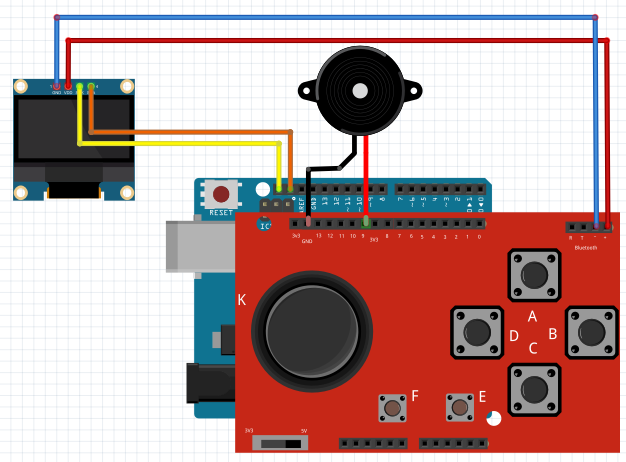
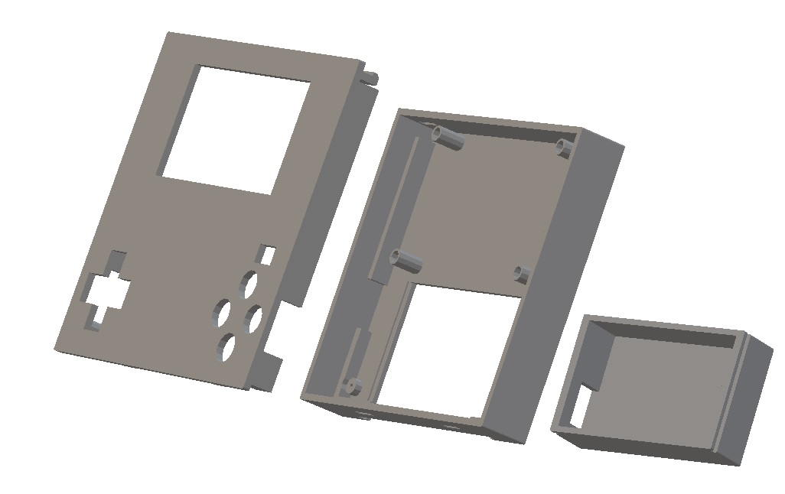
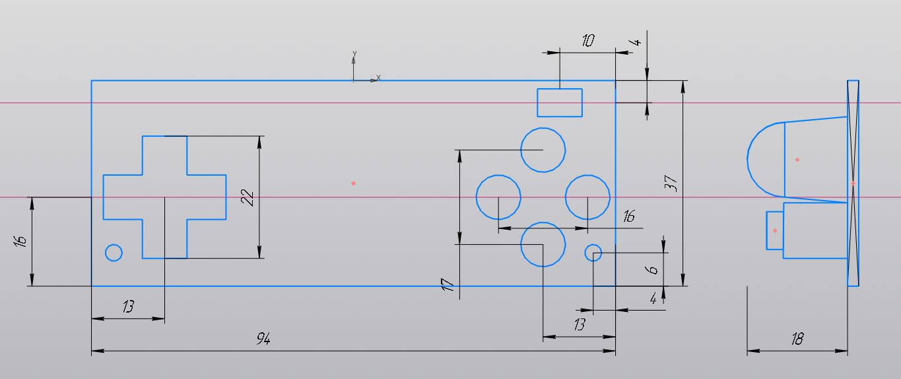
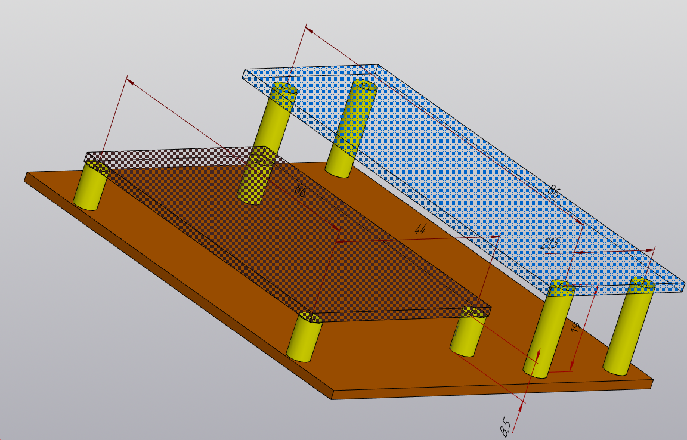

# Варианты сборки приставки

## Funduino Joystick Shield и плата в формате UNO (AVR или MIK32)

* Схема соединений 

## Готовая плата клона Arduboy с модулем в формате Nano (AVR или MIK32)

*(плата устанавливается на верхнуюю часть корпуса)* 

* Детали корпуса. Файлы в формате STL для 3d-печати 

[2_inch_oled_case](./2_inch_oled_case/)

* Корпус (Общий вид) 

* Плата (приблизительные габаритные размеры)

* Вариант сборки без корпуса

----------------------------------

### Ниже приведена предварительная версия данного документа:

Case for Arduino Nano Arduboy clone with 2,42" OLED 
(PCB is installed on the top cover)

* Case [overview](https://github.com/krrrysha/Arduboy-homemade-package/tree/master/hardware/overview.jpg)

* PCB [dimensions](https://github.com/krrrysha/Arduboy-homemade-package/tree/master/hardware/approximate_dimensions_of_the_board.png)

* Mount [without case](https://github.com/krrrysha/Arduboy-homemade-package/tree/master/hardware/mount_with_pcb_standoff.png)
