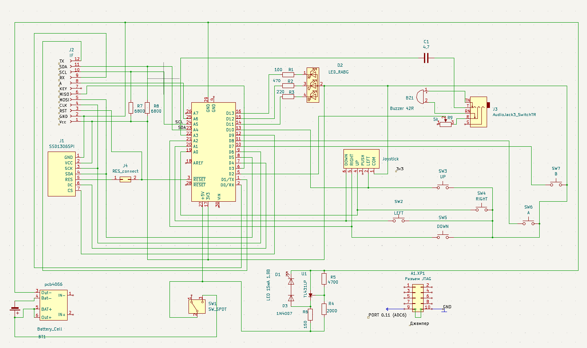
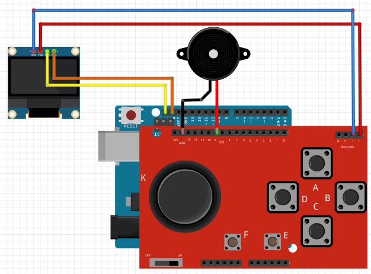
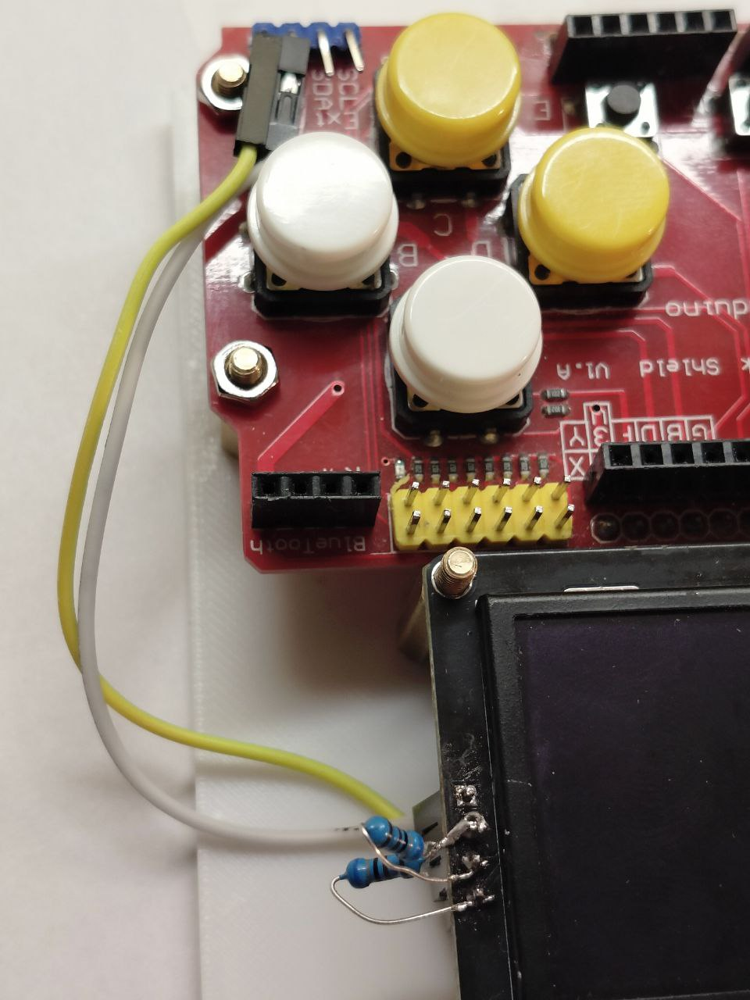
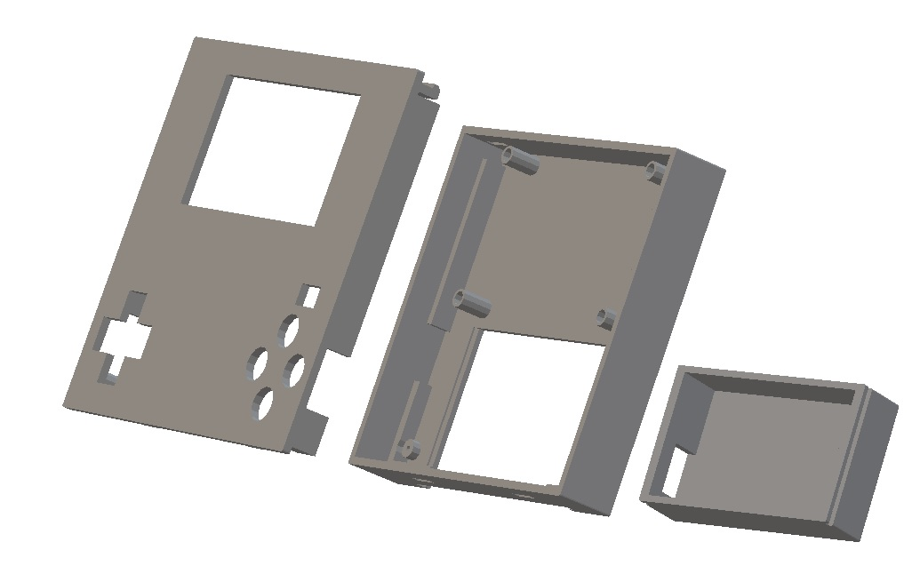
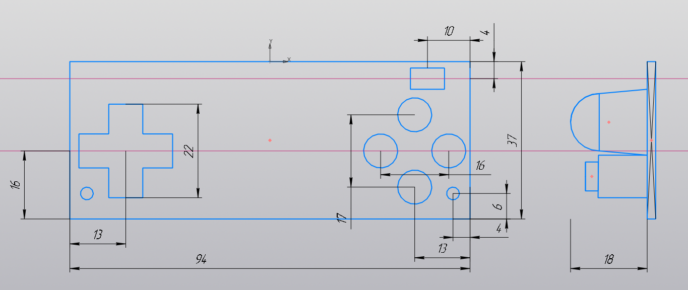

# Варианты сборки приставки

## 1. Вариант на основе платы проекта (в разработке)
[kit](./kit/)

В папке имеется схема версии v0.3b и STL-файл корпуса платы v0.1

## 2. Вариант на основе Funduino Joystick Shield и плата в формате UNO (AVR или MIK32)
[joystick_shield_case](./joystick_shield_case/)

* Схема соединений 

## 3. Устаревший вариант на основе платы стороннего клона Arduboy с маркетплейса. Используется с модулем в формате Nano (AVR или MIK32)

*(плата устанавливается на верхнюю часть корпуса)* 

* Детали корпуса. Файлы в формате STL для 3d-печати:
[2_inch_oled_case](./2_inch_oled_case/)

* Корпус (Общий вид) 

* Плата (приблизительные габаритные размеры)

----------------------------------

